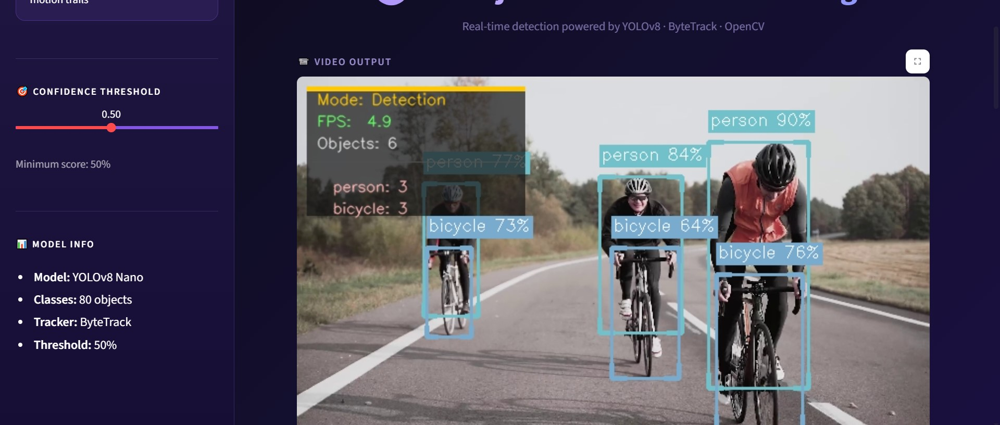

# AI Object Detection & Tracking

Real-time object detection and tracking app built with Python, YOLOv8, OpenCV and Streamlit.



## Features

- Detects the 80 COCO object classes using a pre-trained YOLOv8 Nano model
- Persistent tracking IDs with ByteTrack
- Motion trail visualization
- Live FPS and per-class stats panel
- Supports video upload and webcam input
- Dark purple/lavender Streamlit interface

## Tech Stack

| Technology | Purpose |
|---|---|
| Python 3.x | Core language |
| YOLOv8 Nano (Ultralytics) | Pre-trained object detection model |
| ByteTrack | Multi-object tracking |
| OpenCV | Video processing |
| Streamlit | Web UI |
| cvzone | Enhanced box drawing |

## Project Structure

```
object-detection/
├── app.py            # Streamlit UI
├── detector.py       # YOLO detection logic
├── tracker.py        # Trail history + zone counter
├── utils.py          # Drawing + frame processing
├── requirements.txt
├── demo.png          # App screenshot
└── README.md
```

## How to Run

```bash
# 1. Clone the repo
git clone https://github.com/ash-1212/object-detection.git
cd object-detection

# 2. Create and activate a virtual environment
python -m venv venv
venv\Scripts\activate          # Windows
source venv/bin/activate       # macOS / Linux

# 3. Install dependencies
pip install -r requirements.txt

# 4. Start the app
streamlit run app.py
```

The YOLOv8 model (`yolov8n.pt`, about 6 MB) downloads automatically on the first run, so it is not stored in this repository.

## Test Input

No sample videos are included because of file size. To try the app you can:

- Upload any `.mp4`, `.avi`, `.mov` or `.mkv` file
- Use your webcam directly from the app
- Download a free test video from [Pexels](https://www.pexels.com/videos/)

## How It Works

```
Video / Webcam input
        ↓
OpenCV reads frames
        ↓
YOLOv8 detects objects
        ↓
ByteTrack assigns IDs
        ↓
utils.py draws boxes + trails
        ↓
Streamlit displays live output
```

## Notes

- This project uses a pre-trained YOLOv8 model. It does not include custom model training.
- Speed (FPS) depends on your hardware.

## Author

**Ayesha Nazish**
Built during the CodeAlpha AI Internship.
[GitHub](https://github.com/ash-1212) · [LinkedIn](https://www.linkedin.com/in/ayeshanazish-452048274)
